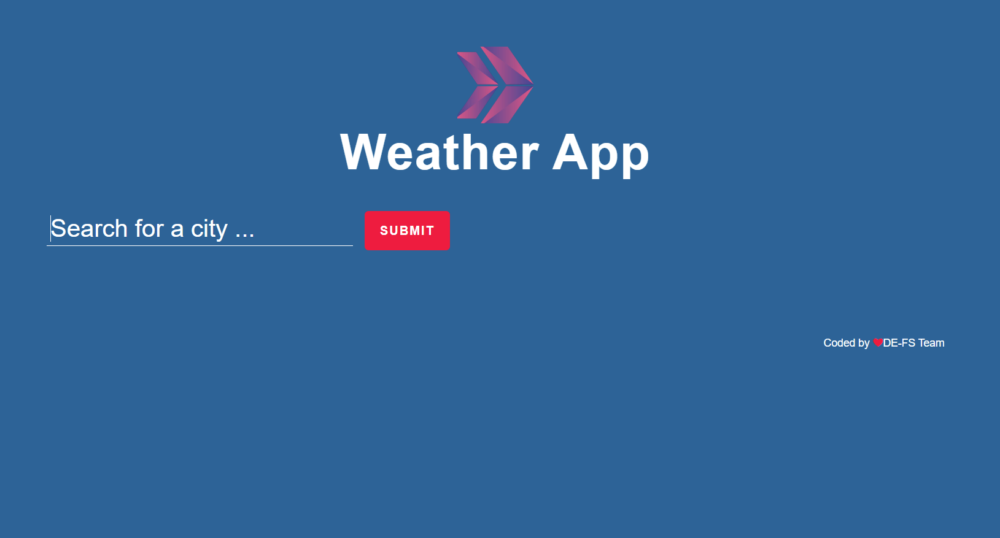
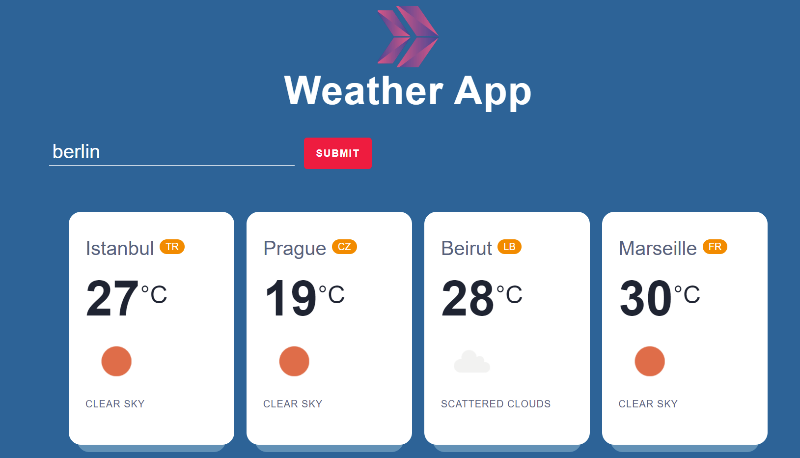

#  :sunny: Weather-App :cloud_with_rain:
> Wearher app enables you to get the daily forecast for the cities. You can view more than one location at a time on the page. To see the application , click [here](https://i-bilge.github.io/Weather-App/)


## Table of contents
  - [Table of contents](#table-of-contents)
  - [General info](#general-info)
  - [Technologies](#technologies)
  - [Features](#features)
  - [How to use](#how-to-use)
  - [Screenshots](#screenshots)
  - [Contact](#contact)

## General info
This project is created to sharpen the use of fetch in JavaScript and fetching APIs along with asyncron coding in JS. It is a part of Projects of The Clarusway IT School - Fullstack Developer Path.

## Technologies
* HTML 
* CSS
* JavaScript

## Features
* Gives the list of weather from cities, you entered

## How to use
```bash
# Clone this repository
$ git clone https://github.com/i-bilge/Weather-App.git

# Work on your local

# Or click on the link above

```


## Screenshots






## Contact
:mailbox_with_mail: You can send me email : iismailbilge@gmail.com :mailbox_with_mail:
